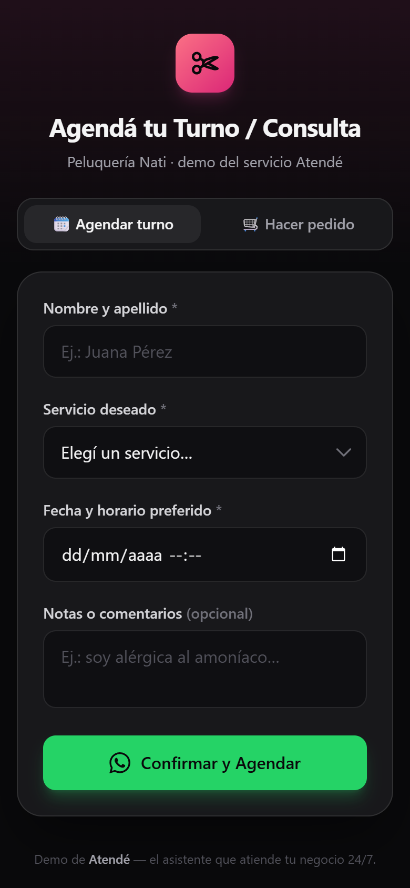
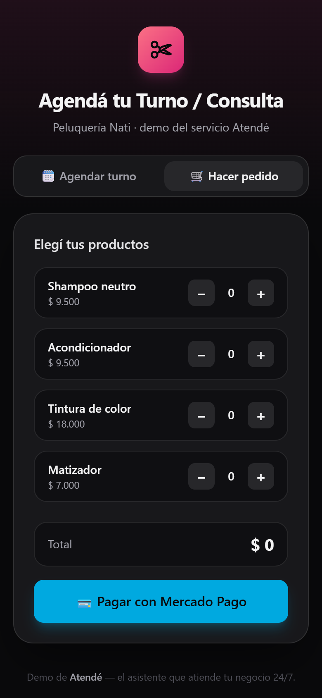
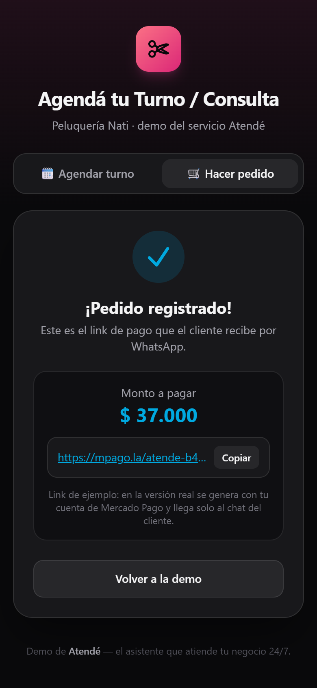

# Atendé — Demo del Agendador de Turnos y Pedidos

Demo interactiva de **Atendé**, el asistente de WhatsApp que atiende tu negocio
24/7. En esta página se muestra, del lado del cliente, cómo se agendan turnos y se
hacen pedidos desde el celular, y cómo todo llega **listo por WhatsApp** y queda
**guardado en la base de datos** (no es un mock: escribe y lee de verdad).

👉 **Probala en vivo:** https://lucianog13.github.io/atende-demo/

---

## Qué muestra la demo

Simula una **peluquería** ("Peluquería Nati") con dos flujos completos:

1. **🗓 Agendar turno** — el cliente completa nombre, servicio, fecha/horario y
   notas. El turno se guarda en la base y se envía un mensaje de WhatsApp al
   comercio con todos los datos.
2. **🛒 Hacer pedido** — el cliente arma un carrito con productos, ve el total y
   recibe un **link de pago de Mercado Pago**.

## Capturas

### 1 · Agendar turno


### 2 · Hacer pedido (carrito)


### 3 · Link de pago (Mercado Pago)


## Cómo funciona

| Flujo | Qué pasa por detrás |
|-------|---------------------|
| **Turnos** | El formulario hace un `POST` a Supabase (tabla `demo_turnos`) y abre WhatsApp con el mensaje prearmado para el número del comercio. |
| **Pedidos** | El carrito suma productos y, al tocar "Pagar con Mercado Pago", se registra en `demo_pedidos` y se muestra un link de pago de ejemplo. |
| **Agenda** | La pantalla de confirmación lista los **últimos turnos reales** guardados en la base. |

## Tecnologías

- **HTML + JavaScript vanilla** — sin frameworks ni paso de build (doble clic y anda).
- **Tailwind CSS** por CDN.
- **Supabase** como base de datos (tablas `demo_turnos` y `demo_pedidos`).
- Paleta propia: verde **WhatsApp**, rosa (peluquería) y azul **Mercado Pago**.

## Relación con el bot real

Esta demo es la **cara visible** de **Atendé**, el bot de WhatsApp multi-negocio.
El motor real —que atiende las conversaciones en WhatsApp con IA (preguntas
frecuentes, turnos, pedidos y pagos)— vive en el repo local del proyecto
(`bot-turnos-whatsapp`), junto con la fuente de esta demo
(`demo/index.html`).

## Estructura

```
atende-demo/
├── index.html        # toda la demo (HTML + CSS + JS en un solo archivo)
├── screenshots/      # capturas para este README
└── README.md         # este archivo
```
